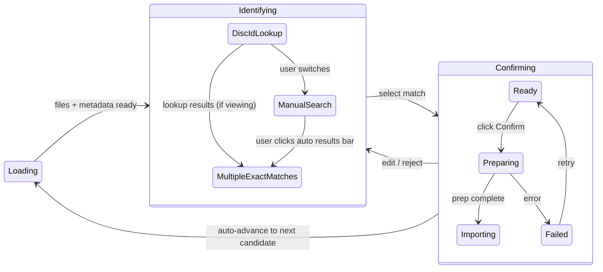

# Import State Machine



**Loading** is before state machine entry (file scan + metadata detection). Once complete, we construct `CandidateState::Identifying` with `mode: IdentifyMode::DiscIdLookup(disc_id)` if discid found, or directly to `ManualSearch`.

The import workflow uses a strongly-typed hierarchical state machine. States require data by construction—no invalid combinations are representable.

## State Shape

A `CandidateState` is only constructed after file scanning and metadata detection complete. Before that, the candidate is in a "loading" phase outside the state machine.

```rust
/// Per-candidate state. Only constructed after detection completes.
enum CandidateState {
    /// User picking from auto matches or searching manually (ImportStep::Identify)
    Identifying(IdentifyingState),
    /// User confirming selection before import (ImportStep::Confirm)
    Confirming(ConfirmingState),
}

struct IdentifyingState {
    files: CategorizedFileInfo,           // required
    metadata: FolderMetadata,             // required - detection done before entry
    mode: IdentifyMode,                   // controls which view is shown
    disc_lookup_status: DiscLookupStatus, // tracks disc ID lookup independently of view
    search_state: ManualSearchState,      // persisted even when in MultipleExactMatches
}

enum IdentifyMode {
    Created,                      // initial, quickly transitions
    DiscIdLookup(String),         // viewing the disc ID lookup screen (loading state)
    MultipleExactMatches(String), // viewing auto results (carries disc_id)
    ManualSearch,                 // viewing manual search
}

/// Disc ID lookup runs independently of the current view.
/// Always present on IdentifyingState (not Optional).
enum DiscLookupStatus {
    NoDiscId,                             // no disc ID could be computed
    InProgress,                           // lookup running
    Found(Vec<MatchCandidate>),           // results available
    NotFound,                             // disc ID searched, no results
    Failed(String),                       // network error (retryable)
}

struct ConfirmingState {
    files: CategorizedFileInfo,           // required
    metadata: FolderMetadata,             // required
    confirmed_candidate: MatchCandidate,  // required
    selected_cover: SelectedCover,
    phase: ConfirmPhase,
    source_disc_id: Option<String>,       // disc_id if came from MultipleExactMatches (for GoBackToIdentify)
}

enum ConfirmPhase {
    Ready,                    // user can edit and click Confirm
    Preparing(String),        // fetching/preparing, shows step text
    Importing,                // import command sent, controls disabled
    Failed(String),           // error message
    Completed,                // import finished successfully
}
```

The state machine reuses shared enum types (`IdentifyMode`, `SearchTab`, `SearchSource`) as discriminants. No separate domain types.

Note: State variants like `DiscIdLookup(String)` and `MultipleExactMatches(String)` carry their associated data explicitly. See [Explicit Data Flow](reactive-state-architecture.md#explicit-data-flow) for the general principle.

## Disc Lookup and View Independence

`mode` (which view is shown) and `disc_lookup_status` (lookup progress) are orthogonal. The lookup runs regardless of which view the user is looking at.

### When viewing DiscIdLookup screen

The identify view shows a loading state while the lookup runs. The user can switch to manual search without waiting.

- Lookup finds results → transition to `MultipleExactMatches` (or straight to `Confirming` if single match)
- Lookup finds nothing → transition to `ManualSearch`
- Lookup fails → show error with retry option

### When viewing ManualSearch (lookup still in background)

The user switched to manual search while the lookup was still in progress. The lookup keeps running.

- Lookup finds results → don't switch views. Update `disc_lookup_status` to `Found`. The existing auto-results bar above the search pane shows that results are available. User can click it to view them.
- Lookup finds nothing → update to `NotFound`, no UI interruption
- Lookup fails → update to `Failed`, no UI interruption

## Behavior Rules

1. **On candidate selection**: Load files + detect metadata (outside state machine). Once complete, construct `CandidateState::Identifying`.

2. **Initial mode after entering Identifying**:
   - If discid found → `mode: IdentifyMode::DiscIdLookup(disc_id)`, `disc_lookup_status: InProgress`
   - If no discid → `mode: ManualSearch`, `disc_lookup_status: NoDiscId`

3. **Disc lookup completes while viewing DiscIdLookup**:
   - Multiple auto matches → `mode: MultipleExactMatches(disc_id)`
   - Single auto match → transition to `Confirming` with `source_disc_id: Some(disc_id)`
   - No matches → `mode: ManualSearch`

4. **Disc lookup completes while viewing ManualSearch**: Update `disc_lookup_status` only. Don't change the view. The auto-results bar reflects the new status.

5. **Auto results cached**: `disc_lookup_status: Found(matches)` persists across view switches. The auto-results bar is always visible when results exist, regardless of current view.

6. **On Confirm click**: Transition phase to `Preparing` → `Importing`. When Importing:
   - Sidebar shows indicator (checkmark/spinner) for that candidate
   - Import appears in Imports dropdown
   - Auto-advance to next candidate that is not Importing/Imported (skip already-in-progress)
   - If no next candidate, stay on current

7. **Selecting an Importing candidate**: Show Confirming view with controls disabled.

## Key Files

- State enums/structs: defined in the bridge/core layer
- Detection: construct CandidateState after detection, handle discid lookup transitions
- Navigation: transitions between states, auto-advance logic
