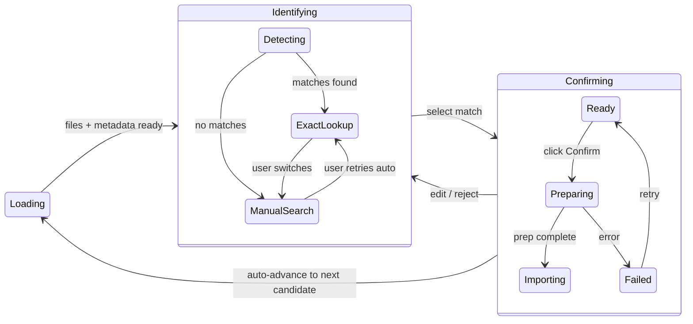

# Import State Machine



**Loading** is before state machine entry (file scan + metadata detection). Once complete, we construct `CandidateState::Identifying` with `mode: IdentifyMode::Detecting` if discid lookup needed, or directly to `ExactLookup`/`ManualSearch`.

The import workflow uses a strongly-typed hierarchical state machine in `bae-desktop`. States require data by construction—no invalid combinations are representable.

## State Shape

A `CandidateState` is only constructed after file scanning and metadata detection complete. Before that, the candidate is in a "loading" phase outside the state machine.

```rust
/// Per-candidate state. Only constructed after detection completes.
enum CandidateState {
    /// User picking from auto matches or searching manually (ImportStep::Identify)
    Identifying(IdentifyingState),
    /// User confirming selection before import (ImportStep::Confirm)
    Confirming(ConfirmingState),
}

struct IdentifyingState {
    files: CategorizedFileInfo,           // required
    metadata: FolderMetadata,             // required - detection done before entry
    mode: IdentifyMode,                   // Detecting (discid lookup) | ExactLookup | ManualSearch
    auto_matches: Vec<MatchCandidate>,    // cached, may be empty
    search_state: ManualSearchState,      // persisted even when in ExactLookup
}

struct ConfirmingState {
    files: CategorizedFileInfo,           // required
    metadata: FolderMetadata,             // required
    confirmed_candidate: MatchCandidate,  // required
    selected_cover: SelectedCover,
    selected_profile_id: String,
    phase: ConfirmPhase,
}

enum ConfirmPhase {
    Ready,                    // user can edit and click Confirm
    Preparing(String),        // fetching/preparing, shows step text
    Importing,                // import command sent, controls disabled
    Failed(String),           // error message
}
```

The state machine reuses `bae-ui` enum types (`IdentifyMode`, `SearchTab`, `SearchSource`) as discriminants. No separate domain types.

## Behavior Rules

1. **On candidate selection**: Load files + detect metadata (outside state machine). Once complete, construct `CandidateState::Identifying`.

2. **Initial mode after entering Identifying**:
   - If discid found → `mode: IdentifyMode::Detecting` (discid lookup in flight)
   - After discid lookup completes:
     - Multiple auto matches → `mode: ExactLookup`
     - Single auto match → transition to `Confirming(Ready)` with option to switch to manual
     - No auto matches → `mode: ManualSearch`
   - If no discid → `mode: ManualSearch` immediately

3. **Auto results cached**: Switching to ManualSearch keeps `auto_matches` in state; user can return to ExactLookup.

4. **On Confirm click**: Transition phase to `Preparing` → `Importing`. When Importing:
   - Sidebar shows indicator (checkmark/spinner) for that candidate
   - Import appears in Imports dropdown
   - Auto-advance to next candidate that is not Importing/Imported (skip already-in-progress)
   - If no next candidate, stay on current

5. **Selecting an Importing candidate**: Show Confirming view with controls disabled.

## Key Files

- `bae-desktop/src/ui/import_context/state.rs` — state enums/structs
- `bae-desktop/src/ui/import_context/detection.rs` — construct CandidateState after detection, handle discid lookup transitions
- `bae-desktop/src/ui/import_context/navigation.rs` — transitions between states, auto-advance logic
- `bae-desktop/src/ui/components/import/workflow/folder_import.rs` — derive props from state enum
